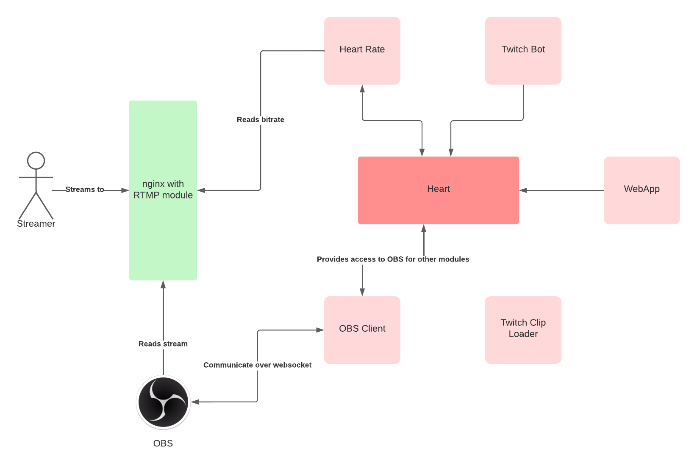

  

<h1 align="center">Streamheart</h1>
Streamheart is an intelligent modular streaming platform for IRL streams on Twitch.

Streamheart has a central middleware (heart) through which applications that provide various functions connect. Each application can register to the middleware and subscribe other application.

## Features
- Bitrate tracker of RTMP connection
  - Automatic switch to BRB in OBS if a threshold is reached
  - :information_source: Needs modified nginx RTMP module. Not yet published.
- Twitch bot
  - Control OBS over Twitch chat (start, stop, switch scenes, screenshot)
  - Notifications of bitrate, scene switches, etc.
  - Enable / disable automatic BRB switch
- WebApp
  - Control OBS over browser (start, stop, switch scenes)
  - Enable / disable automatic BRB switch
  - Show / hide OBS overlay
  - Refresh stream
- Twitch clips loader
  - Downloads most viewed clips of the same day, last 7 days, last month and overall
